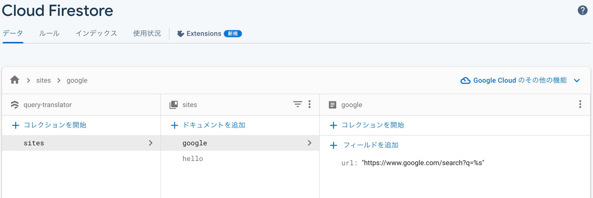

# QueryTranslator

クエリをDeepLで日英翻訳して検索する

## Usage

```bash
https://gae-url.com/search?site=google&q=こんにちは、世界
# 翻訳してリダイレクト => https://www.google.com/search?q=Hello%20World
```

Firestore上で、サイトurlを管理するので、必要に応じて追加・削除可能


## Setup

- service accounts
  - DeepL API, GAE, Firestore
- files
  - ```git clone https://github.com/Wisteria30/qt.git```
  - credentials.json
    - google cloudのサービスアカウントから取得するやつ
  - secret.yaml
```yaml
env_variables:
  DEEPL_AUTH_KEY: "XXXXXXXXXXXXXXXXXXXXXXXXXXXXXXXX"
```

```bash
gcloud app deploy
```
